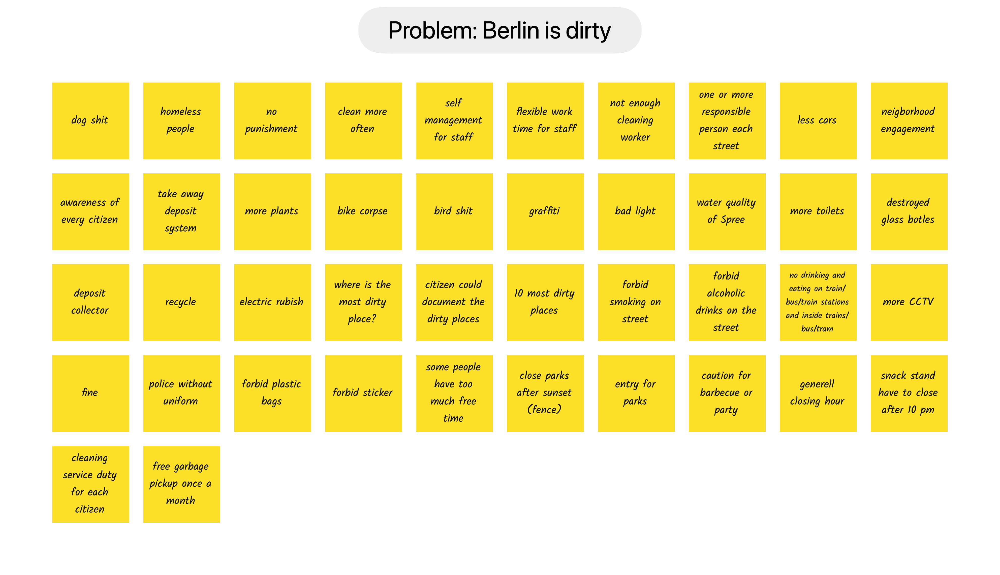
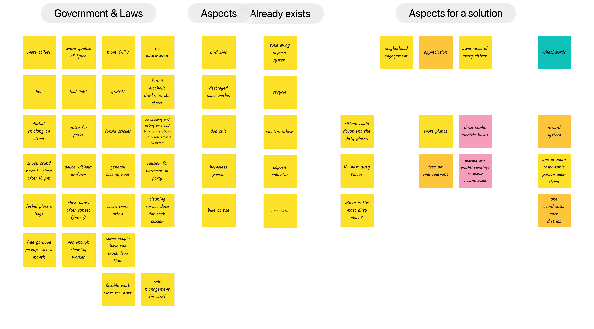

# Blog post

## Genesis
During the learning phase of the UX track, we should focus on a real problem. The participant lives in the center of Berlin. In his view, big cities have a lot of dirty and ugly places. He wants to improve this situation and started an ideation session with the brainstorming method to frame the problem. Many aspects were identified:

The recognition was, that there are a lot of things we can’t change, but there is a bit we could improve. So, what could we do?

At the end, three possible implementation priorities were identified:

- Tree pits
- Electric boxes
- Waste

Tree pits and electric boxes are public places open to everyone. The idea was to become a volunteer. You make a request to the authority. Then you can paint on the electric box or plant flowers on a tree pit. Beautify Berlin was born. We could build a platform to answer the 
following questions:
- Where are these places?
- How do a place look at the moment?
- How can I take responsibility?

For the waste, the idea was to organize cleaning events.

## Begin of the project phase
It quickly became clear that we need to focus on one aspect due to time constraints. Because there is already a good solution for cleaning events (www.kehrenbuerger.de), we focus on places.
During the first weeks everybody was still busy with the learning material, but we tried to continue ideation on our jour fix. One problem was, that it wasn’t clear who will continue the project phase. So, everybody was working a bit for himself. Our team started with seven members. After one month, two members left.

### UX
During this time, three personas and scenarios were created:

- [Personas and Scenarios](../Ideation/personas_and_scenarios.md)

## Start working

### UX
The UX team – now, one person – began to prototype with Figma. Fortunately, it was possible to use the personas, IA models and wireframes from the learning phase. The first prototype was almost ready:

- [App design](https://www.figma.com/file/WunBh8jid7aBkE3PaULYJN/Beautify-Berlin-Team-App)

Sadly, the assumption that we will create an app, was wrong and, it was necessary to create a new prototype:

- [One page design](https://www.figma.com/file/0AK9722OIix2XmdvpDzQTO/Beautify-Berlin-Team-One-Page)

Wish and reality: After the second prototype, two more constrains became known. The first one was, that it would be not possible to implement a map view. For UX, the map was essential. The second constrain was, that the webpage could not be a single page. With these new constrains, a new, third prototype was created:

- [Left menu design](https://www.figma.com/file/w3QxvPi3P6AIknlGKbMtks/Beautify-Berlin-Team-Left-Menu-Design)

Because it was no longer possible to create a left side menu, a fourth and final prototype was created:

- [Final design](https://www.figma.com/file/8ivTAUNeGlCChKno5PKCTR/Beautify-Berlin-Team)

This prototype also includes the view of an owner.

### Data
Besides the work on the prototype, the UX team member could use his cartographic knowledge to collect the data. There was a Web Feature Service (WFS) for electric boxes on the open data portal of Berlin available. With the help of the program QGIS, it was able to transform this data in to a GeoJSON file. To get a better name for the places, the what3words API was used to get its name. After the information, that it would not be possible to implement a map view, Open Street Map was used to reverse geocode to get address data for the places. All information are combined in this file:
- Filename.geojason 
